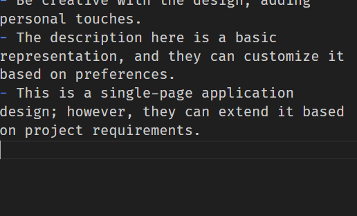

# Personal Portfolio Website

## Week 1-2: HTML and CSS Basics

### Learning Objectives

- *HTML Basics:*
  - Understand the structure of HTML.
  - Learn about HTML tags and attributes.

- *CSS Basics:*
  - Understand the basics of CSS.
  - Learn how to style HTML elements.

### Project Tasks

1. *Create a Static Webpage:*
   - Build a simple personal webpage using HTML.
   - Include sections such as "About Me," "Skills," and "Contact."
   - Add appropriate HTML tags for headings, paragraphs, lists, and links.

2. *Style the Webpage with CSS:*
   - Apply CSS styles to the HTML elements.
   - Use basic styling properties like color, font-size, margin, padding, etc.
   - Focus on creating an aesthetically pleasing design.

3. *Responsive Design:*
   - Make the webpage responsive to different screen sizes.
   - Use media queries to adjust styles for different devices.

### Tips

- *Semantic HTML:*
  - Use of semantic HTML for better accessibility and SEO.
  
- *Responsive Design:*
  - Prioritize a responsive design approach, ensuring the webpage looks good on both desktop and mobile devices.
  
- *Project Structure:*
  - Maintain a clean and organized project structure.

## Week 3-4: Introduction to React

### Learning Objectives

- *React Basics:*
  - Understand the basic concepts of React, including components and JSX.
  - Learn to set up a React application using create-react-app.

- *Component Creation:*
  - Gain proficiency in creating functional and class components.
  - Understand the JSX syntax.

### Project Tasks

1. *Convert Webpage to React:*
   - Set up a new React application using create-react-app.
   - Convert the static HTML webpage into a React application.
   - Create a separate React component for each section (About Me, Skills, Contact).

2. *Navigation Bar Component:*
   - Implement a simple navigation bar component using React Router.
   - Create links to navigate between different sections of the webpage.

3. *Basic Styling in React:*
   - Apply basic styling to React components using CSS-in-JS or a separate CSS file.
   - Ensure that the styling is consistent with the original static webpage.

### Tips

- *JSX and Components:*
  - Use of JSX and the creation of components in React.

- *React Router:*
  - Learn the basics of React Router and how to use it for navigation.

- *Styling in React:*
  - Learn the different approaches to styling in React, such as inline styles, CSS modules, or styled-components.

---

## UI Mockup

### Header Section

- *Logo:* Personal Logo or Name
- *Navigation:*
  - Home
  - About Me
  - Skills
  - Projects
  - Contact

### Main Section

- *About Me:*
  - Profile Picture
  - Brief Introduction

- *Skills:*
  - List of Skills (e.g., Programming Languages, Frameworks, Tools)
  - Maybe represented as tags or icons

- *Projects:*
  - Cards or Tiles for Each Project
  - Project Name, Description, and Link to Details

### Sidebar or Navigation Bar (Responsive Design)

- *Responsive Navigation:*
  - Collapsible menu for smaller screens
  - Hamburger icon to toggle navigation on mobile devices

### Contact Section

- *Contact Form:*
  - Fields for Name, Email, Message
  - Submit Button

### Footer Section

- *Social Links:*
  - Icons for LinkedIn, GitHub, Twitter, etc.
- *Copyright Information:*
  - © 2023 Your Name

### Screenshots

## Design Considerations

- *Color Scheme:*
  - Choose a color scheme that reflects their personality or a professional look.
- *Typography:*
  - Select clear and readable fonts for text elements.
- *Images:*
  - Use high-quality images for the profile picture and project thumbnails.
- *Responsive Design:*
  - Ensure the design is responsive for various screen sizes.

---

## Additional Features (Optional)

- *Responsive Design:* Ensure that the portfolio is responsive and looks good on various devices.
- *Animations:* Add subtle animations using CSS or a library like react-spring to make the portfolio more visually appealing.
- *Project Details:* Allow users to click on a project in the project section to view more details about that project.
- *Blog Section:* Include a blog section where they can write and publish short articles.
- *External API Integration:* Integrate an external API to display dynamic content, such as GitHub repositories or Twitter feeds.

---

## Notes

- Be creative with the design, adding personal touches.
- The description here is a basic representation, and they can customize it based on preferences.
- This is a single-page application design; however, they can extend it based on project requirements.
